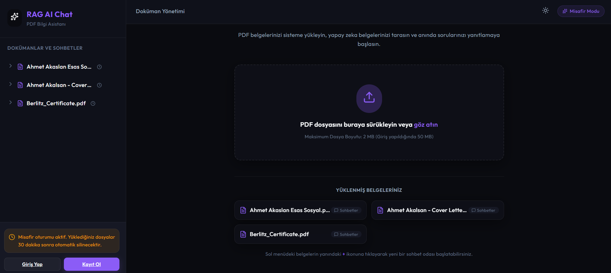
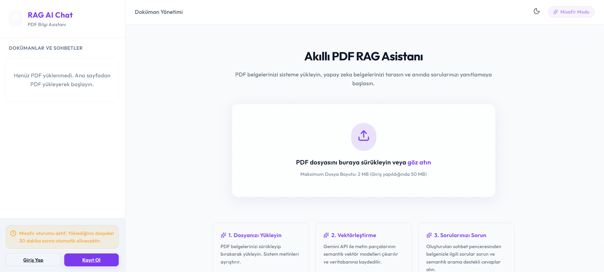
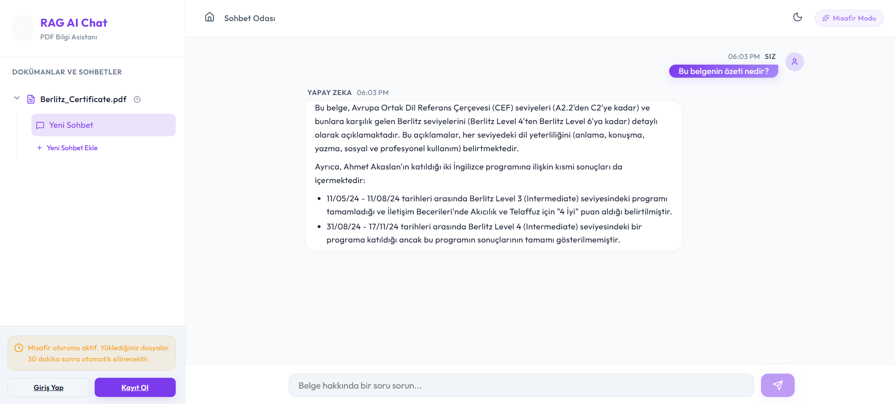
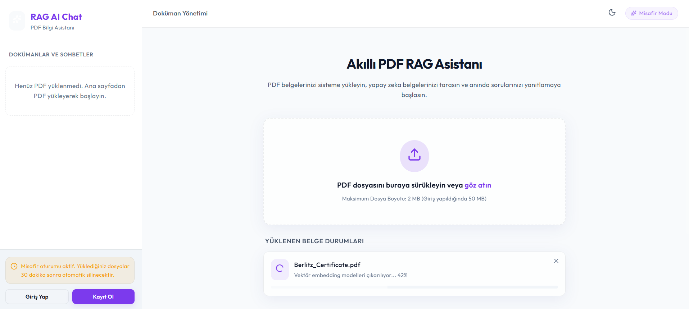

<h1 align="center">
  <br>
  🤖 RAG AI Chat
  <br>
</h1>

<h4 align="center">
  PDF belgelerinizi yükleyin, yapay zeka ile konuşun — Retrieval-Augmented Generation mimarisi üzerine kurulu, tam yığın bir belge sohbet asistanı.
</h4>

<p align="center">
  
  
  
  
  
  
  
  
  
  
</p>

---

## 📖 Proje Hakkında

**RAG AI Chat**, kullanıcıların PDF belgelerini sisteme yükleyip bu belgeler üzerinde yapay zeka destekli sohbet açmasına olanak tanıyan, üretime hazır bir **Retrieval-Augmented Generation (RAG)** uygulamasıdır.

Yüklenen PDF'ler otomatik olarak ayrıştırılır, anlamlı parçalara bölünür, **Google Gemini Embedding API** ile vektörleştirilir ve **pgvector** uzantısı kullanan PostgreSQL veritabanında saklanır. Kullanıcı bir soru sorduğunda sistem, soruya en yakın metin parçalarını semantik benzerlik arama ile bulur ve Gemini Chat modeline bağlam olarak iletir.

---

## 📸 Ekran Görüntüleri

<table>
  <tr>
    <td align="center" width="50%">
      <b>🌙 Ana Ekran — Karanlık Tema</b><br/><br/>
      
    </td>
    <td align="center" width="50%">
      <b>☀️ Ana Ekran — Açık Tema</b><br/><br/>
      
    </td>
  </tr>
  <tr>
    <td align="center" width="50%">
      <b>💬 Sohbet Ekranı — AI Yanıtı (Markdown Render)</b><br/><br/>
      
    </td>
    <td align="center" width="50%">
      <b>⚙️ PDF İşleme — Gerçek Zamanlı İlerleme</b><br/><br/>
      
    </td>
  </tr>
</table>

---


```
Multi_rag_nest_next/
├── backend/          # NestJS REST API + WebSocket Gateway
│   └── README.md     # Backend kurulum ve API dokümantasyonu
├── frontend/         # React + Vite SPA
│   └── README.md     # Frontend kurulum dokümantasyonu
├── docker-compose.yml # PostgreSQL (pgvector) + Redis servisleri
└── .env.example       # Ortam değişkenleri şablonu
```

### Teknoloji Yığını

| Katman | Teknoloji |
|---|---|
| **Backend Framework** | NestJS (TypeScript) |
| **Frontend Framework** | React 19 + Vite |
| **Veritabanı** | PostgreSQL 17 + pgvector |
| **Önbellek & Kuyruk** | Redis + BullMQ |
| **AI Modeli** | Google Gemini 2.5 Flash (Chat) + Gemini Embedding 2 |
| **Gerçek Zamanlı** | Socket.io (WebSocket) |
| **ORM** | TypeORM |
| **Kimlik Doğrulama** | JWT (Access + Refresh Token) |
| **Dosya Depolama** | Yerel (Local) veya Amazon S3 (Strategy Pattern) |
| **Konteynerizasyon** | Docker Compose |

---

## ✨ Özellikler

### 🔐 Kimlik Doğrulama
- **Çift Token (Dual Token) Mimarisi** — Kısa ömürlü Access Token + uzun ömürlü Refresh Token
- **Misafir Modu** — Kayıt olmadan 2 MB'a kadar PDF yükleme ve sohbet
- **Kayıtlı Kullanıcı** — 50 MB'a kadar PDF yükleme, veriler kalıcı
- JWT Guard + Roles Guard ile endpoint koruması

### 📄 Belge İşleme (Asenkron Pipeline)
- **PDF Yükleme** — Multer ile çok parçalı form verisi işleme, MIME doğrulama
- **Metin Ayrıştırma** — `pdf-parse` ile PDF içeriği çıkarma, null-byte temizliği
- **Metin Bölümleme (Chunking)** — Anlamlı boyutlarda parçalara ayırma
- **Vektörleştirme (Embedding)** — Google Gemini Embedding API ile 768 boyutlu vektörler
- **Asenkron Kuyruk** — BullMQ ile arka planda işleme, uygulama kesintisiz çalışır
- **Gerçek Zamanlı İlerleme** — Socket.io ile yüzde bazlı işlem durumu bildirimi

### 💬 Sohbet (RAG Pipeline)
- **Semantik Arama** — pgvector cosine similarity ile en alakalı metin parçaları
- **Bağlam Destekli Yanıt** — Bulunan parçalar Gemini'ye bağlam olarak iletilir
- **Çoklu Sohbet Odası** — Her belge için birden fazla bağımsız sohbet oturumu
- **WebSocket Mesajlaşma** — Gerçek zamanlı mesaj gönderme/alma
- **Markdown Render** — AI yanıtlarında kalın, italic, liste, kod bloğu desteği
- **Yazıyor İndikatörü** — AI yanıt hazırlarken animasyonlu geri bildirim

### 🎨 Arayüz
- **Karanlık / Açık Tema** — LocalStorage'da kalıcı tercih
- **Duyarlı Tasarım** — Mobil ve masaüstü uyumlu
- **Sohbet Baloncukları** — Kullanıcı sağda (mor gradient), AI solda
- **Hızlı Soru Butonları** — Boş sohbet ekranında hazır soru önerileri
- **PDF Durumu** — Yükleme, ayrıştırma, vektörleştirme, tamamlandı akışı
- **Şifre Göster/Gizle** — Giriş ve kayıt formlarında göz ikonu

### 🛡️ Güvenlik & Operasyon
- **IDOR Koruması** — Her kaynak sahibi doğrulaması
- **Rate Limiting** — Throttler ile yükleme endpoint'i sınırlandırma
- **Cron Temizliği** — Her 30 dakikada misafir verisi ve yetim dosya temizleme
- **Global Hata Yakalayıcı** — Tüm hataları dosyaya loglama
- **Strategy Pattern** — Depolama katmanı Local/S3 arasında değiştirilebilir

---

## 🚀 Hızlı Başlangıç

### Ön Koşullar

- [Node.js](https://nodejs.org/) v18+
- [Docker](https://www.docker.com/) ve Docker Compose
- [Google AI Studio](https://aistudio.google.com/) hesabı (ücretsiz Gemini API anahtarı)

### 1. Repoyu Klonla

```bash
git clone https://github.com/kullanici-adi/rag-ai-chat.git
cd rag-ai-chat
```

### 2. Ortam Değişkenlerini Ayarla

```bash
cp .env.example .env
```

`.env` dosyasını açıp en az şu alanı doldur:

```env
GEMINI_API_KEY=your_gemini_api_key_here
```

### 3. Veritabanı ve Redis'i Başlat (Docker)

```bash
docker compose up -d
```

Bu komut şunları başlatır:
- **PostgreSQL 17 + pgvector** → `localhost:5432`
- **Redis 7** → `localhost:6379`

### 4. Backend'i Başlat

```bash
cd backend
npm install
npm run start:dev
```

API `http://localhost:3000` adresinde hazır olacak.

> 📌 Backend ilk başlatmada pgvector ve uuid-ossp uzantılarını otomatik oluşturur, tablo migrasyonlarını otomatik çalıştırır.

### 5. Frontend'i Başlat

```bash
cd frontend
npm install
npm run dev
```

Uygulama `http://localhost:5173` adresinde açılacak.

---

## 📁 Klasör Yapısı

```
backend/
├── src/
│   ├── auth/           # JWT kimlik doğrulama (register, login, refresh, logout)
│   ├── chat/           # Sohbet oturumları, mesajlar, WebSocket Gateway
│   ├── cleanup/        # Cron tabanlı misafir veri temizleme servisi
│   ├── common/         # Guard, Decorator, Filter, Interceptor, Util
│   ├── config/         # Joi ile ortam değişkeni doğrulama
│   ├── database/       # TypeORM + pgvector yapılandırması
│   ├── documents/      # PDF yükleme, doğrulama, CRUD
│   ├── gemini/         # Google Gemini AI istemcisi (embedding + chat)
│   ├── queue/          # BullMQ kuyruk modülü ve DocumentProcessor worker
│   ├── rag/            # Chunk bölümleme, vektör kaydetme, benzerlik arama
│   ├── storage/        # Storage Strategy (Local / S3)
│   └── users/          # Kullanıcı modülü

frontend/
├── src/
│   ├── api/            # Axios instance + chat/document API çağrıları
│   ├── components/     # Auth, Chat, Documents, Layout, Common bileşenleri
│   ├── contexts/       # AuthContext, SocketContext, RAGContext
│   ├── hooks/          # useGuestId
│   └── pages/          # HomePage, ChatPage, LoginPage, RegisterPage
```

---

## 🔌 API Uç Noktaları

| Yöntem | Uç Nokta | Açıklama | Kimlik Doğrulama |
|---|---|---|---|
| `POST` | `/api/auth/register` | Yeni kullanıcı kaydı | — |
| `POST` | `/api/auth/login` | Giriş, token çifti döner | — |
| `POST` | `/api/auth/refresh` | Access token yenileme | Refresh Token |
| `POST` | `/api/auth/logout` | Çıkış | JWT |
| `POST` | `/api/documents/upload` | PDF yükleme | Opsiyonel |
| `GET` | `/api/documents` | Kullanıcının belgelerini listele | JWT |
| `DELETE` | `/api/documents/:id` | Belge ve ilişkili verileri sil | JWT |
| `POST` | `/api/chat/sessions` | Yeni sohbet odası oluştur | JWT |
| `GET` | `/api/chat/sessions` | Sohbet odalarını listele | JWT |
| `GET` | `/api/chat/sessions/:id/messages` | Mesajları getir | JWT |
| `POST` | `/api/chat/sessions/:id/messages` | Mesaj gönder (RAG tetikler) | JWT |
| `PATCH` | `/api/chat/sessions/:id` | Sohbet adını değiştir | JWT |
| `DELETE` | `/api/chat/sessions/:id` | Sohbet odasını sil | JWT |

### WebSocket Olayları (Socket.io)

| Olay | Yön | Açıklama |
|---|---|---|
| `join-room` | Client → Server | Sohbet odasına katıl |
| `leave-room` | Client → Server | Sohbet odasından ayrıl |
| `new-message` | Server → Client | Yeni mesaj bildirimi |
| `document-progress` | Server → Client | PDF işleme ilerleme durumu |

---

## ⚙️ Ortam Değişkenleri

Tam liste için [`.env.example`](.env.example) dosyasına bakın.

| Değişken | Varsayılan | Açıklama |
|---|---|---|
| `PORT` | `3000` | Backend sunucu portu |
| `DB_HOST` | `localhost` | PostgreSQL host |
| `DB_NAME` | `rag_chat_db` | Veritabanı adı |
| `REDIS_HOST` | `localhost` | Redis host |
| `GEMINI_API_KEY` | — | **Zorunlu.** Google AI API anahtarı |
| `GEMINI_CHAT_MODEL` | `gemini-2.5-flash` | Sohbet modeli |
| `GEMINI_EMBEDDING_MODEL` | `gemini-embedding-2` | Embedding modeli |
| `JWT_ACCESS_SECRET` | — | **Zorunlu.** En az 32 karakter |
| `JWT_REFRESH_SECRET` | — | **Zorunlu.** En az 32 karakter |
| `STORAGE_TYPE` | `local` | `local` veya `s3` |
| `THROTTLE_LIMIT` | `20` | Yükleme rate limit (istek/TTL) |

---

## 🐳 Docker Compose Servisleri

```bash
# Servisleri başlat
docker compose up -d

# Logları izle
docker compose logs -f

# Servisleri durdur
docker compose down

# Verileri de sil
docker compose down -v
```

---

## 📜 Lisans

Bu proje [MIT Lisansı](LICENSE) altında lisanslanmıştır.

---

<p align="center">
  <sub>🛠️ NestJS + React + pgvector + Google Gemini ile geliştirildi</sub>
</p>
